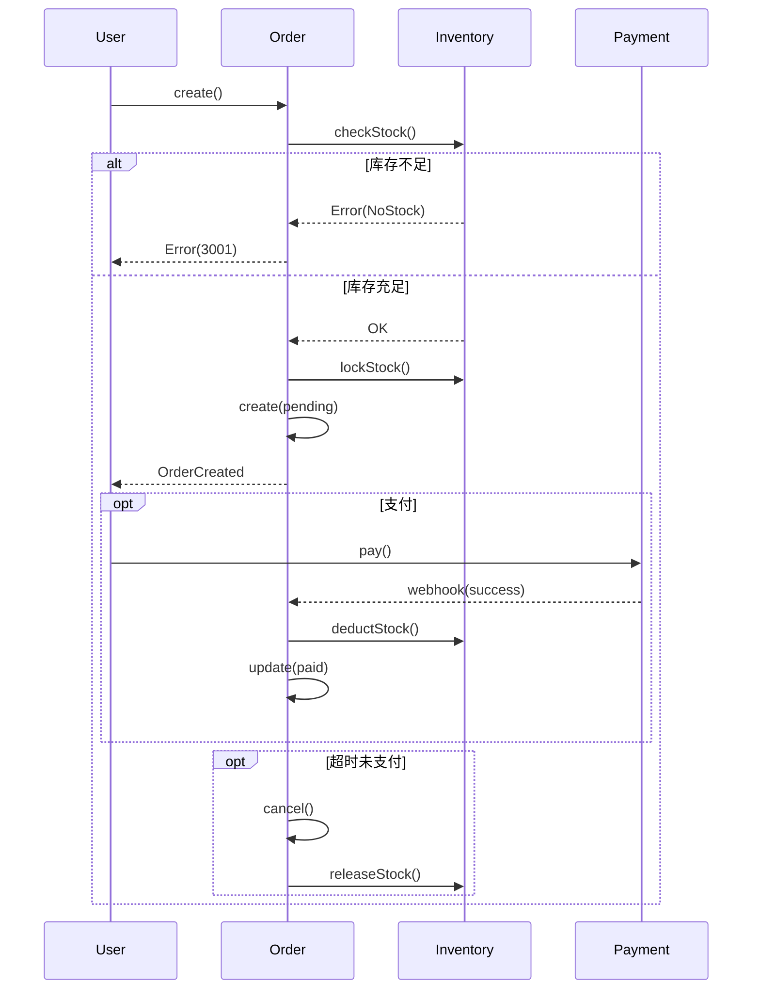
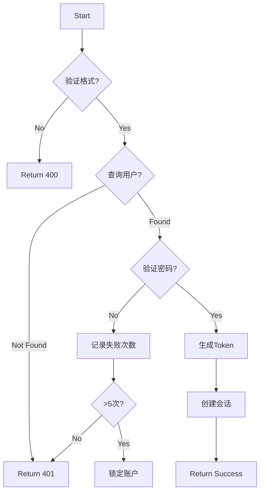
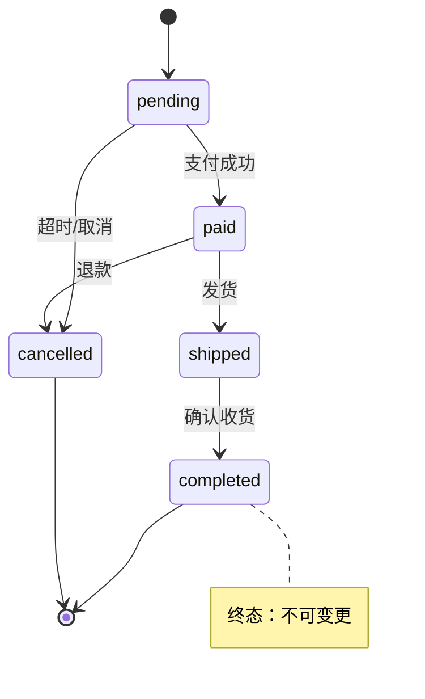
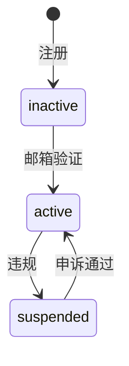

# 关键流程

> 理解复杂业务流程或状态机细节时加载

## 流程概览

| 流程     | 类型   | 入口                    | 涉及模块                  |
| -------- | ------ | ----------------------- | ------------------------- |
| 订单处理 | 工作流 | `OrderService.create()` | order, payment, inventory |
| 用户认证 | 工作流 | `AuthService.login()`   | auth, user, session       |
| 订单状态 | 状态机 | `Order.status`          | order                     |
| 用户状态 | 状态机 | `User.status`           | user                      |

## Invariants（业务不变量）

> 系统始终需满足的约束

- **库存守恒**: `总库存 = 在售 + 锁定 + 已售`
- **金额精度**: 所有货币计算必须使用整数(分)或 Decimal，禁止浮点数运算
- **订单终态**: 订单一旦进入 `completed` 或 `cancelled` 状态，不可再变更
- **支付幂等**: 同一 `transaction_id` 只能被成功处理一次

## 订单处理流程

**入口**: `services/order.ts` → `create()`

| 步骤     | 文件                    | 函数               |
| -------- | ----------------------- | ------------------ |
| 校验库存 | `services/inventory.ts` | `checkStock()`     |
| 锁定库存 | `services/inventory.ts` | `lockStock()`      |
| 创建订单 | `services/order.ts`     | `create()`         |
| 支付处理 | `services/payment.ts`   | `processPayment()` |
| 扣减库存 | `services/inventory.ts` | `deductStock()`    |

**异常**: 库存不足→`BizError(3001)`；支付失败→保留 pending、用户重试；超时30min→自动取消+释放库存、定时任务补偿

## 用户认证流程

**入口**: `services/auth.ts` → `login()`

## 订单状态机

`Order.status` · `models/order.ts`

| 当前    | 允许转换  | 触发          | 函数                 |
| ------- | --------- | ------------- | -------------------- |
| pending | paid      | 支付回调      | `onPaymentSuccess()` |
| pending | cancelled | 超时/用户取消 | `cancelOrder()`      |
| paid    | shipped   | 商家发货      | `shipOrder()`        |
| paid    | cancelled | 退款          | `refundOrder()`      |
| shipped | completed | 确认收货/超时 | `completeOrder()`    |

**🔴 禁止**: `completed/cancelled` 为终态，不可变更

## 用户状态机

`User.status`

| 状态      | 值  | 权限     |
| --------- | --- | -------- |
| inactive  | 0   | 不可登录 |
| active    | 1   | 完整权限 |
| suspended | 2   | 只读     |

## 定时任务

| 任务     | Cron          | 功能                |
| -------- | ------------- | ------------------- |
| 订单超时 | `*/5 * * * *` | 取消30min未支付订单 |
| 自动收货 | `0 2 * * *`   | 发货15天后自动完成  |

## 修改注意

| 变更类型   | 检查项              |
| ---------- | ------------------- |
| 状态机变更 | 存量数据兼容性      |
| 流程变更   | 异常处理 + 回滚逻辑 |
| 新增状态   | 转换规则 + 权限检查 |
